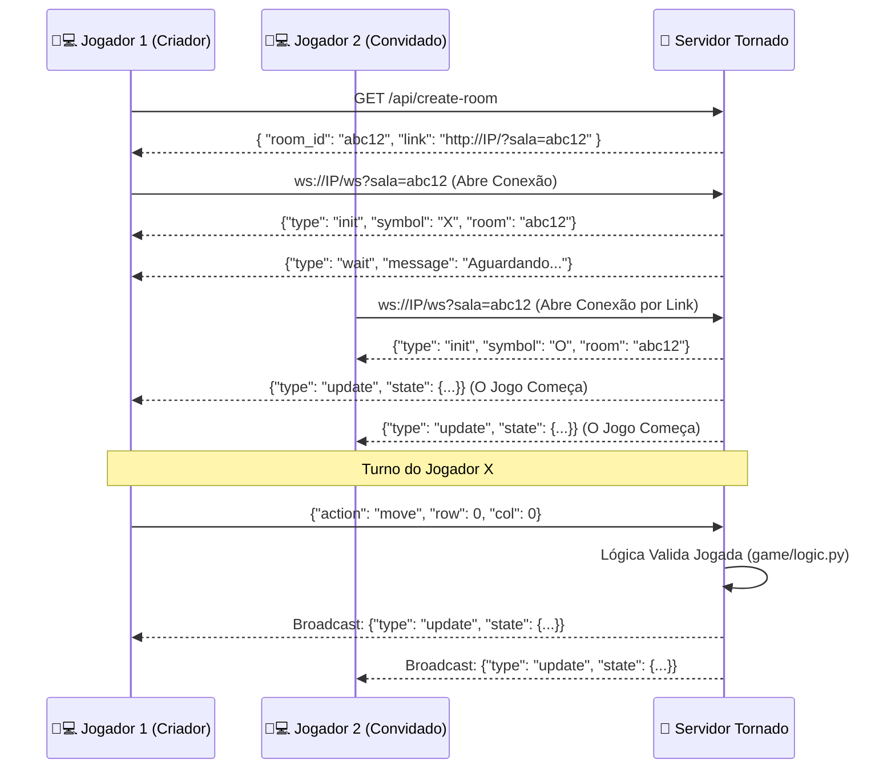
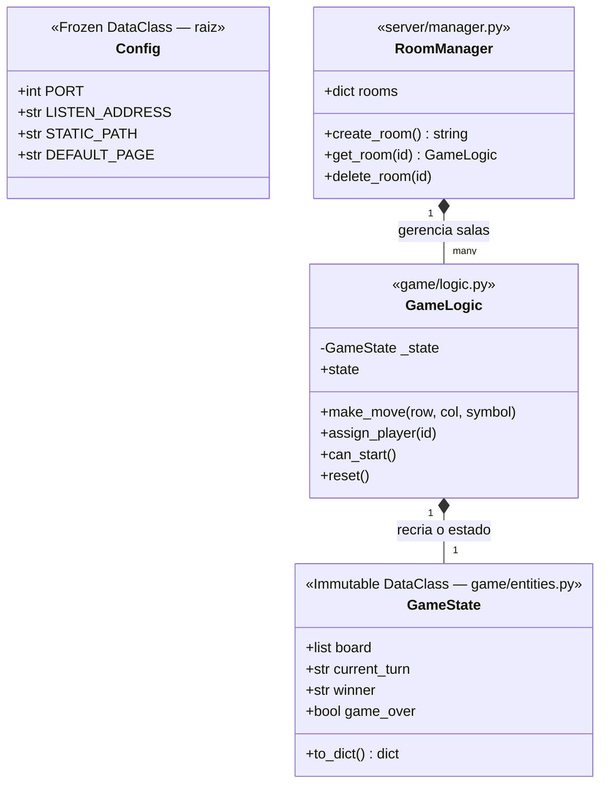
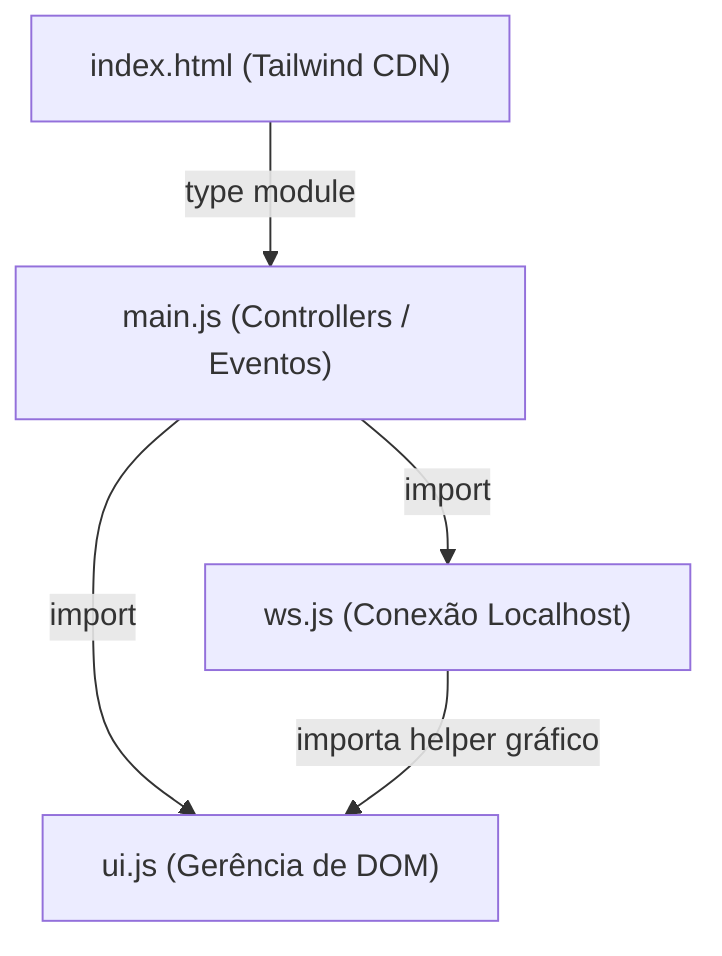

## 🏛️ Ground Truth: Arquitetura e Fluxo do Jogo (Gabarito Oculto do Mestre)

### Estrutura de Camadas (Clean Architecture)

```
jogo-da-velha-websocket/    ← Raiz do Projeto
├── main.py                 ← Bootstrap: wiring de todas as camadas
├── config.py               ← Infraestrutura transversal (usado por todas as camadas)
├── logger.py               ← Infraestrutura transversal (idem)
├── Makefile
├── requirements.txt
│
├── game/                   ← Camada de Domínio (pura, zero dependência de framework)
│   ├── __init__.py
│   ├── entities.py         ← GameState — modelo de dados imutável
│   └── logic.py            ← GameLogic — regras do jogo
│
├── server/                 ← Camada de Aplicação (Tornado-specific)
│   ├── __init__.py
│   ├── handlers.py         ← Transporte HTTP + WebSocket
│   └── manager.py          ← Orquestração de salas
│
└── client/                 ← Camada de Apresentação
    └── static/
        ├── index.html
        ├── style.css
        ├── main.js
        ├── ui.js
        └── ws.js
```

**Regra de Dependência (Dependency Rule):**
- `game/` não conhece `server/`, `config` nem `logger` — domínio puro
- `server/` conhece `game/`, `config` e `logger`
- `main.py` conhece tudo e faz o wiring
- `config.py` e `logger.py` na raiz são transversais a todas as camadas

---

### Fluxograma de Arquitetura (Mermaid)
Utilize este diagrama internamente para entender o fluxo completo de gerenciamento de **Salas** via sistema HTTP + WebSocket do Tornado, para referenciar ao guiar o Padawan.



### Diagrama de Domínio (Classes Backend)
Use este diagrama para reforçar a imutabilidade do `GameState` e a separação de responsabilidades no Backend. O Padawan não pode misturar lógica na controller de WebSocket!



### Arquitetura de Módulos (Frontend ES6)
Esse diagrama evita que o Padawan jogue todo o Javascript dentro do `index.html`. Cobre dele os imports isolados.


